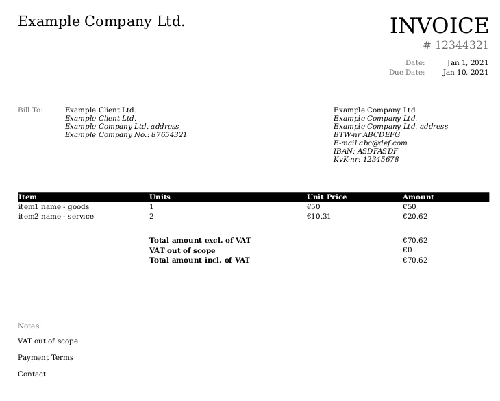

[](https://makeapullrequest.com)
[](https://github.com/psf/black)


# PyInvoicer

Commandline tool to generate HTML-based and PDF invoices.

PyInvoicer is a light-weight commandline tool written in Python to generate HTML-based and PDF invoices.
The usage is very straightforward and easy to use:
prepare your invoice content in YAML as the input of PyInvoicer.
That's it!! No complicated setup like database is needed.

Quick highlights:

- run locally
- content of input in YAML
- output html and pdf
- use as less third party dependency as possible


.

## Getting Started

### Prerequisites
* [Python](https://www.python.org/downloads/)

The release has been tested with Python 3.9.1.

### Installation
The tool has been released to PyPI. You can install it directly from PyPI via pip.

```
pip install pyinvoicer
```

If you want to install from the source, you may need `poetry`, the package dependency management tool.
This project is managed by `poetry`. Fetch the source and `poetry install`. See [Contributing](contributing.md) for
more details.


## Usage
```buildoutcfg
invoicer <your content yaml>
```

You will get `invoice.pdf` in the same folder. The [examples](examples/simple-invoice.yaml) folder of the source
shows an example of the content yaml.


### Output in Different Format
For example, if you want to output your invoice in html, invoke:
```buildoutcfg
invoicer <your content yaml> --format html
```


### Output with Customized Name and Path
```buildoutcfg
invoicer <your content yaml> /path/you/want/to/use/your-invoice.pdf
```


### More Usage Options
Please refer to `invoicer --help`.


## Contributing
See [Contributing](contributing.md)


## Authors
Taihsiang Ho (tai271828) <tai271828@gmail.com>


Created from [Lee-W/cookiecutter-python-template](https://github.com/Lee-W/cookiecutter-python-template/tree/0.7.2) version 0.7.2
